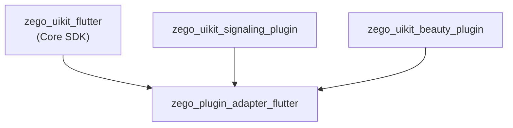
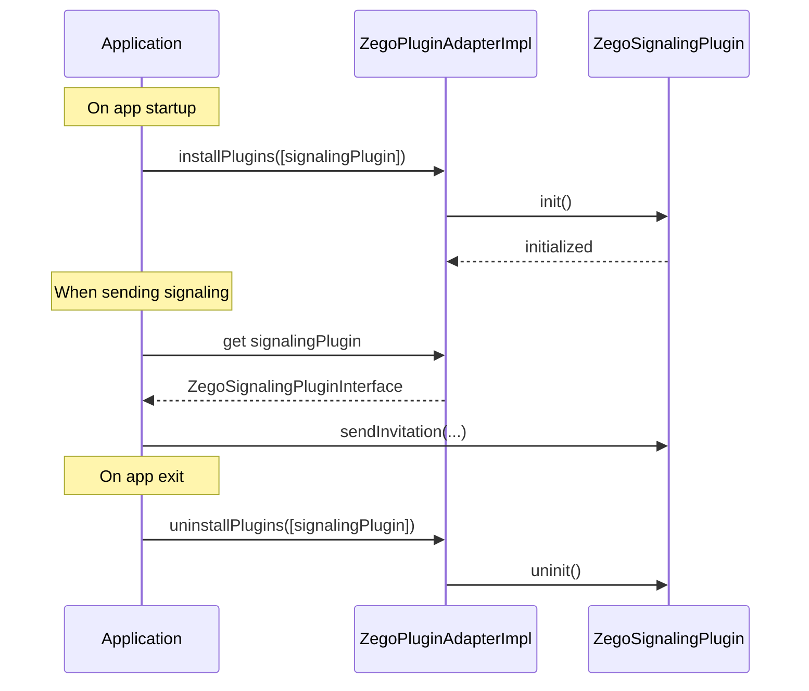

# ZegoPluginAdapter Architecture

> Plugin adapter layer - provides unified plugin interfaces for zego_uikit

## Overview

`zego_plugin_adapter_flutter` is the **plugin adapter layer** that defines abstract interfaces all ZegoUIKit plugins must implement:

- Unified plugin lifecycle management
- Plugin install/uninstall
- Plugin type definitions
- Signaling/CallKit/Beauty abstract interfaces

**This is not a developer-facing package**, but a底层 interface definition for other SDKs.

## Package Relationship



## Core Concept: Plugin Interface

All plugins must implement the `IZegoUIKitPlugin` interface:

```dart
/// Base plugin interface
abstract class IZegoUIKitPlugin {
  /// Get plugin type
  ZegoUIKitPluginType getPluginType();

  /// Initialize plugin
  Future<void> init();

  /// Uninitialize plugin
  Future<void> uninit();

  /// Get plugin version
  String getVersion();
}
```

## Plugin Types

```dart
enum ZegoUIKitPluginType {
  signaling,  // Signaling plugin
  beauty,     // Beauty plugin
  callkit,    // CallKit plugin
}
```

## ZegoPluginAdapterImpl

Plugin management singleton, responsible for plugin install, uninstall, and retrieval:

```dart
class ZegoPluginAdapterImpl {
  /// Installed plugins notifier
  final pluginsInstallNotifier = ValueNotifier<List<ZegoUIKitPluginType>>([]);

  /// Plugin instance map
  Map<ZegoUIKitPluginType, IZegoUIKitPlugin?> plugins = {
    for (var type in ZegoUIKitPluginType.values) type: null
  };

  /// Install multiple plugins
  void installPlugins(List<IZegoUIKitPlugin> instances);

  /// Uninstall multiple plugins
  void uninstallPlugins(List<IZegoUIKitPlugin> instances);

  /// Get signaling plugin
  ZegoSignalingPluginInterface? get signalingPlugin;

  /// Get CallKit plugin
  ZegoCallKitInterface? get callkit;

  /// Get beauty plugin
  ZegoBeautyPluginInterface? get beautyPlugin;

  /// Check if plugin is installed
  bool isPluginInstalled(ZegoUIKitPluginType type);
}
```

## Plugin Usage Flow



## Beauty Plugin Interface

Abstract interface for beauty plugins:

```dart
/// Beauty plugin interface
abstract class ZegoBeautyPluginInterface extends IZegoUIKitPlugin {
  /// Set beauty parameters
  Future<void> setBeautyParams(ZegoBeautyParams params);

  /// Enable/disable beauty
  Future<void> enableBeauty(bool enable);

  /// Get current beauty parameters
  ZegoBeautyParams getBeautyParams();

  /// Check if a beauty feature is supported
  bool isFeatureSupported(ZegoBeautyFeature feature);
}
```

### Beauty Params

```dart
class ZegoBeautyParams {
  double smoothLevel;      // Smooth level (0-100)
  double whitenLevel;      // Whitening level (0-100)
  double rosyLevel;         // Rosy level (0-100)
  double sharpenLevel;      // Sharpen level (0-100)
}
```

### Beauty Features

```dart
enum ZegoBeautyFeature {
  smooth,    // Smooth
  whiten,    // Whitening
  rosy,      // Rosy
  sharpen,   // Sharpen
  facelift,  // Facelift
  bigEye,    // Big eyes
}
```

## CallKit Interface

Abstract interface for iOS CallKit:

```dart
/// CallKit plugin interface
abstract class ZegoCallKitInterface extends IZegoUIKitPlugin {
  /// Show incoming call
  Future<void> showIncomingCall({
    required String callID,
    required String callerName,
    bool hasVideo,
  });

  /// Accept incoming call
  Future<void> acceptCall(String callID);

  /// Reject incoming call
  Future<void> rejectCall(String callID);

  /// End call
  Future<void> endCall(String callID);

  /// Report call ended (for CallKit)
  Future<void> reportCallEnded(String callID);

  /// Update call duration
  Future<void> reportCallConnected(String callID);
}
```

## Signaling Interface

Abstract interface for signaling plugins (used for call invitations):

```dart
/// Signaling plugin interface
abstract class ZegoSignalingPluginInterface extends IZegoUIKitPlugin {
  /// Initialize
  Future<void> init({
    required int appID,
    required String appSign,
    required String userID,
    required String userName,
    ZegoSignalingConfig? config,
  });

  /// Send invitation
  Future<String> sendInvitation({
    required String inviterID,
    required String inviteeID,
    required String customData,
    int timeout = 60,
    ZegoSignalingNotifyConfig? notifyConfig,
  });

  /// Cancel invitation
  Future<void> cancelInvitation(String invitationID);

  /// Accept invitation
  Future<void> acceptInvitation(String invitationID);

  /// Refuse invitation
  Future<void> refuseInvitation(String invitationID);

  /// Set offline invitation config
  Future<void> setOfflineInvitation(ZegoSignalingOfflineConfig config);

  /// Sync invitation state (for recovery)
  Future<void> syncInvitationState();
}
```

## Directory Structure

```
lib/src/
├── adapter.dart              # ZegoPluginAdapterImpl main class
├── defines.dart              # Public defines (ZegoUIKitPluginType, etc.)
├── error.dart                # Error defines
├── beauty/                  # Beauty plugin interface
│   ├── beauty.dart           # Interface definition
│   ├── config.dart           # Config class
│   ├── defines.dart          # Defines
│   ├── enums.dart            # Enums
│   ├── errors.dart           # Errors
│   ├── interface.dart        # Main interface
│   └── ui_config.dart        # UI config
├── callkit/                 # CallKit interface
│   ├── callkit.dart          # Interface definition
│   ├── defines.dart          # Defines
│   ├── enums.dart            # Enums
│   └── interface.dart        # Main interface
├── signaling/               # Signaling interface
│   ├── signaling.dart        # Interface definition
│   ├── config.dart           # Config
│   ├── defines.dart          # Defines
│   ├── errors.dart           # Errors
│   └── interface.dart        # Main interface
└── services/               # Adapter services
    ├── adapter_service.dart  # Adapter service
    ├── logger_service.dart   # Logger service
    └── system.dart           # System utilities
```

## Implementing a Plugin

Implementing a new plugin requires:

```dart
class MyCustomPlugin implements ZegoBeautyPluginInterface {
  @override
  ZegoUIKitPluginType getPluginType() => ZegoBeautyPluginInterface;

  @override
  Future<void> init() async {
    // Initialize native SDK
  }

  @override
  Future<void> uninit() async {
    // Uninitialize
  }

  @override
  Future<void> setBeautyParams(ZegoBeautyParams params) async {
    // Apply beauty params to native SDK
  }

  @override
  Future<void> enableBeauty(bool enable) async {
    // Enable/disable beauty
  }

  @override
  String getVersion() => '1.0.0';
}
```

### Register Plugin

```dart
// On app startup
ZegoPluginAdapterImpl().installPlugins([
  MyCustomPlugin(),
]);

// Or multiple plugins
ZegoPluginAdapterImpl().installPlugins([
  ZegoSignalingPlugin(),
  ZegoBeautyPlugin(),
  ZegoCallKitPlugin(),
]);
```

## Key Implementations

Actual plugin implementations:

| Package | Implements | Location |
|---------|------------|----------|
| `zego_uikit_beauty_plugin_flutter` | `ZegoBeautyPluginInterface` | lib/src/beauty_plugin.dart |
| `zego_uikit_signaling_plugin_flutter` | `ZegoSignalingPluginInterface` | lib/src/signaling.dart |

## Common Issues

### 1. Plugin Not Installed

```dart
// ✗ Wrong
final plugin = ZegoPluginAdapterImpl().signalingPlugin;  // null

// ✓ Correct - install first
ZegoPluginAdapterImpl().installPlugins([ZegoSignalingPlugin()]);
final plugin = ZegoPluginAdapterImpl().signalingPlugin;  // valid
```

### 2. Duplicate Installation

Reinstalling the same plugin replaces the instance:

```dart
// Second install of same type replaces
adapter.installPlugins([newPlugin]);
// plugin type already exists, will update plugin instance
```

## Related Documentation

- [ZegoUIKit Architecture](../zego_uikit_flutter/ARCHITECTURE.md)
- [ZegoUIKitSignalingPlugin Architecture](../zego_uikit_signaling_plugin_flutter/ARCHITECTURE.md)
- [ZegoUIKitBeautyPlugin Architecture](../zego_uikit_beauty_plugin_flutter/ARCHITECTURE.md)
