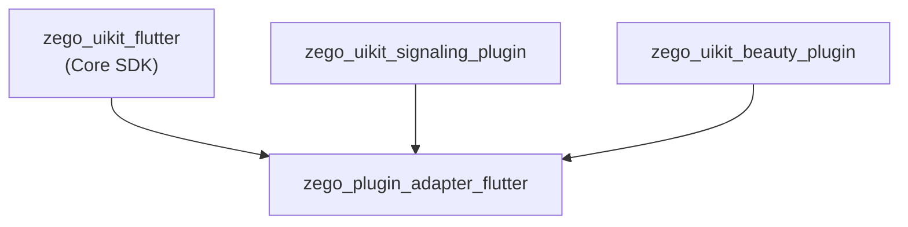
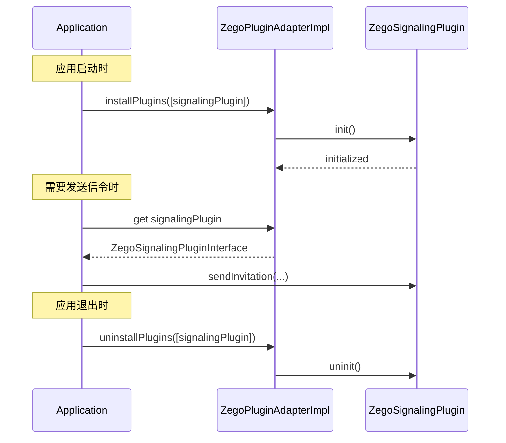

# ZegoPluginAdapter Architecture

> 插件适配层 - 为 zego_uikit 提供统一插件接口

## Overview

`zego_plugin_adapter_flutter` 是**插件适配层**，定义所有 ZegoUIKit 插件必须实现的抽象接口：

- 统一插件生命周期管理
- 插件安装/卸载
- 插件类型定义
- 信令/CallKit/美颜抽象接口

**这不是面向开发者的包**，而是供其他 SDK 使用的底层接口定义。

## Package Relationship



## Core Concept: Plugin Interface

所有插件必须实现 `IZegoUIKitPlugin` 接口：

```dart
/// 插件基接口
abstract class IZegoUIKitPlugin {
  /// 获取插件类型
  ZegoUIKitPluginType getPluginType();

  /// 初始化插件
  Future<void> init();

  /// 反初始化插件
  Future<void> uninit();

  /// 获取插件版本
  String getVersion();
}
```

## Plugin Types

```dart
enum ZegoUIKitPluginType {
  signaling,  // 信令插件
  beauty,     // 美颜插件
  callkit,    // CallKit 插件
}
```

## ZegoPluginAdapterImpl

插件管理单例，负责插件的安装、卸载、获取：

```dart
class ZegoPluginAdapterImpl {
  /// 已安装插件通知
  final pluginsInstallNotifier = ValueNotifier<List<ZegoUIKitPluginType>>([]);

  /// 插件实例映射
  Map<ZegoUIKitPluginType, IZegoUIKitPlugin?> plugins = {
    for (var type in ZegoUIKitPluginType.values) type: null
  };

  /// 安装多个插件
  void installPlugins(List<IZegoUIKitPlugin> instances);

  /// 卸载多个插件
  void uninstallPlugins(List<IZegoUIKitPlugin> instances);

  /// 获取信令插件
  ZegoSignalingPluginInterface? get signalingPlugin;

  /// 获取 CallKit 插件
  ZegoCallKitInterface? get callkit;

  /// 获取美颜插件
  ZegoBeautyPluginInterface? get beautyPlugin;

  /// 检查插件是否已安装
  bool isPluginInstalled(ZegoUIKitPluginType type);
}
```

## Plugin Usage Flow



## Beauty Plugin Interface

美颜插件的抽象接口：

```dart
/// 美颜插件接口
abstract class ZegoBeautyPluginInterface extends IZegoUIKitPlugin {
  /// 设置美颜参数
  Future<void> setBeautyParams(ZegoBeautyParams params);

  /// 开启/关闭美颜
  Future<void> enableBeauty(bool enable);

  /// 获取当前美颜参数
  ZegoBeautyParams getBeautyParams();

  /// 是否支持某个美颜类型
  bool isFeatureSupported(ZegoBeautyFeature feature);
}
```

### Beauty Params

```dart
class ZegoBeautyParams {
  double smoothLevel;      // 磨皮级别 (0-100)
  double whitenLevel;      // 美白级别 (0-100)
  double rosyLevel;        // 红润级别 (0-100)
  double sharpenLevel;     // 锐化级别 (0-100)
}
```

### Beauty Features

```dart
enum ZegoBeautyFeature {
  smooth,    // 磨皮
  whiten,    // 美白
  rosy,      // 红润
  sharpen,   // 锐化
  facelift,  // 瘦脸
  bigEye,    // 大眼
}
```

## CallKit Interface

iOS CallKit 通话的抽象接口：

```dart
/// CallKit 插件接口
abstract class ZegoCallKitInterface extends IZegoUIKitPlugin {
  /// 显示来电
  Future<void> showIncomingCall({
    required String callID,
    required String callerName,
    bool hasVideo,
  });

  /// 接听来电
  Future<void> acceptCall(String callID);

  /// 拒绝来电
  Future<void> rejectCall(String callID);

  /// 结束通话
  Future<void> endCall(String callID);

  /// 报告通话完成（用于 CallKit）
  Future<void> reportCallEnded(String callID);

  /// 更新通话时间
  Future<void> reportCallConnected(String callID);
}
```

## Signaling Interface

信令插件的抽象接口（用于通话邀请）：

```dart
/// 信令插件接口
abstract class ZegoSignalingPluginInterface extends IZegoUIKitPlugin {
  /// 初始化
  Future<void> init({
    required int appID,
    required String appSign,
    required String userID,
    required String userName,
    ZegoSignalingConfig? config,
  });

  /// 发送邀请
  Future<String> sendInvitation({
    required String inviterID,
    required String inviteeID,
    required String customData,
    int timeout = 60,
    ZegoSignalingNotifyConfig? notifyConfig,
  });

  /// 取消邀请
  Future<void> cancelInvitation(String invitationID);

  /// 接受邀请
  Future<void> acceptInvitation(String invitationID);

  /// 拒绝邀请
  Future<void> refuseInvitation(String invitationID);

  /// 设置离线邀请配置
  Future<void> setOfflineInvitation(ZegoSignalingOfflineConfig config);

  /// 同步邀请状态（用于恢复）
  Future<void> syncInvitationState();
}
```

## Directory Structure

```
lib/src/
├── adapter.dart              # ZegoPluginAdapterImpl 主类
├── defines.dart              # 公共定义（ZegoUIKitPluginType 等）
├── error.dart                # 错误定义
├── beauty/                  # 美颜插件接口
│   ├── beauty.dart           # 接口定义
│   ├── config.dart           # 配置类
│   ├── defines.dart          # 定义
│   ├── enums.dart            # 枚举
│   ├── errors.dart           # 错误
│   ├── interface.dart        # 主接口
│   └── ui_config.dart        # UI 配置
├── callkit/                 # CallKit 接口
│   ├── callkit.dart          # 接口定义
│   ├── defines.dart          # 定义
│   ├── enums.dart            # 枚举
│   └── interface.dart        # 主接口
├── signaling/               # 信令接口
│   ├── signaling.dart        # 接口定义
│   ├── config.dart           # 配置
│   ├── defines.dart          # 定义
│   ├── errors.dart           # 错误
│   └── interface.dart        # 主接口
└── services/               # 适配服务
    ├── adapter_service.dart  # 适配服务
    ├── logger_service.dart   # 日志服务
    └── system.dart           # 系统工具
```

## Implementing a Plugin

实现一个新的插件需要：

```dart
class MyCustomPlugin implements ZegoBeautyPluginInterface {
  @override
  ZegoUIKitPluginType getPluginType() => ZegoBeautyPluginInterface;

  @override
  Future<void> init() async {
    // 初始化原生 SDK
  }

  @override
  Future<void> uninit() async {
    // 反初始化
  }

  @override
  Future<void> setBeautyParams(ZegoBeautyParams params) async {
    // 应用美颜参数到原生 SDK
  }

  @override
  Future<void> enableBeauty(bool enable) async {
    // 开启/关闭美颜
  }

  @override
  String getVersion() => '1.0.0';
}
```

### 注册插件

```dart
// 在应用启动时
ZegoPluginAdapterImpl().installPlugins([
  MyCustomPlugin(),
]);

// 或多个插件
ZegoPluginAdapterImpl().installPlugins([
  ZegoSignalingPlugin(),
  ZegoBeautyPlugin(),
  ZegoCallKitPlugin(),
]);
```

## Key Implementations

实际插件实现在以下包中：

| Package | Implements | Location |
|---------|------------|----------|
| `zego_uikit_beauty_plugin_flutter` | `ZegoBeautyPluginInterface` | lib/src/beauty_plugin.dart |
| `zego_uikit_signaling_plugin_flutter` | `ZegoSignalingPluginInterface` | lib/src/signaling.dart |

## Common Issues

### 1. 插件未安装

```dart
// ✗ 错误
final plugin = ZegoPluginAdapterImpl().signalingPlugin;  // null

// ✓ 正确 - 先安装
ZegoPluginAdapterImpl().installPlugins([ZegoSignalingPlugin()]);
final plugin = ZegoPluginAdapterImpl().signalingPlugin;  // 有效
```

### 2. 重复安装

重复安装同一个插件会更新实例：

```dart
// 第二次安装相同类型会替换
adapter.installPlugins([newPlugin]);
// plugin type already exists, will update plugin instance
```

## Related Documentation

- [ZegoUIKit Architecture](../zego_uikit_flutter/ARCHITECTURE.md)
- [ZegoUIKitSignalingPlugin Architecture](../zego_uikit_signaling_plugin_flutter/ARCHITECTURE.md)
- [ZegoUIKitBeautyPlugin Architecture](../zego_uikit_beauty_plugin_flutter/ARCHITECTURE.md)